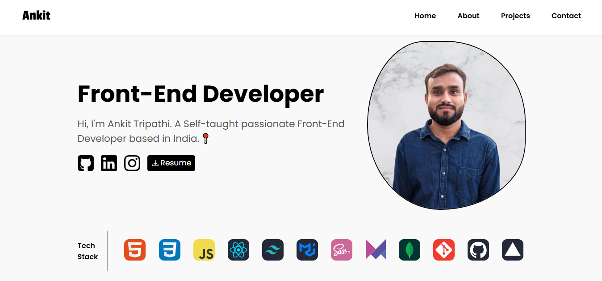
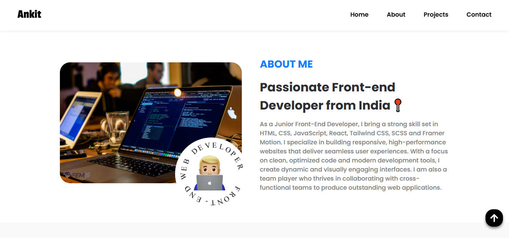
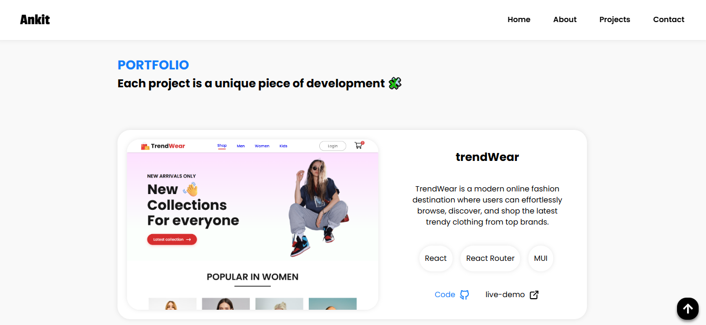
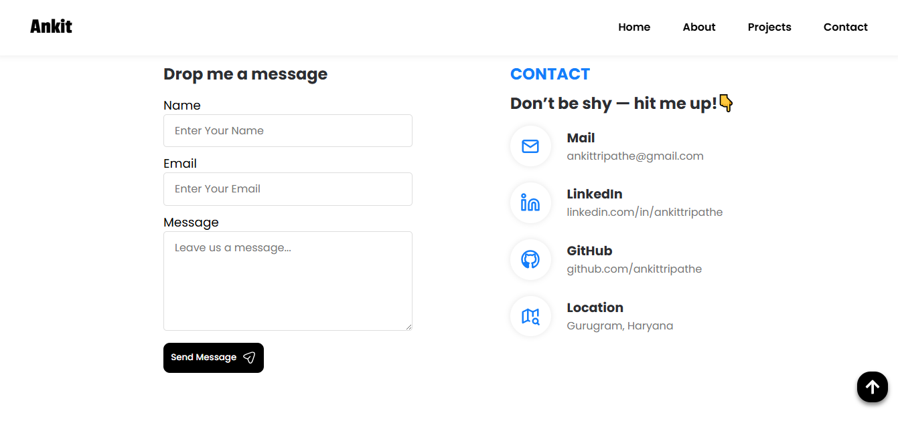

# 🚀 Ankit - Portfolio Website 💻
Hi, I am Ankit Tripathi, A Front-End Web Developer.

## 🛠 Technologies Used
- HTML
- CSS
- Javascript
- React
- React-toastify
- Web3Forms


<!-- ************************ -->
## Features 🎉
- Responsive design 📱
- Dark mode toggle 🌑
- Scroll to top button ⬆️
- Contact form with emailjs integration 📧
- Qualification section with tabs 📚
- Skills section with frontend, backend, and other skills 💻
- About section with introduction, background, goals, and interests 📝
- Home section with hero image, title, and description 🏠
- Footer with copyright information 📜


## 📸 Screenshots

| Home Page                      |
| ------------------------------ |
|  |

| About Page                       |
| -------------------------------- |
|  |

| Project Page                         |
| ------------------------------------ |
|  |

| Contact Page                         |
| ------------------------------------ |
|  |

## 🔗 Links
- 🌐 **Live Demo**: [https://lnkd.in/drtsgfVk](https://ankittripathi.vercel.app/)
- 📁 **GitHub Repo**: [https://lnkd.in/g-m6hC2Y](https://github.com/ankittripathe/PortFolio-Website)


## 📦 Getting Started

### Prerequisites

- Node.js (v14 or above)
- npm or yarn

## 🚀 How to Run the Project

```bash
# 1. Clone the repository
git clone https://github.com/ankittripathe/PortFolio-Website.git
cd PortFolio-Website

# 2. Install dependencies
npm install

# 3. Start the development server
npm run dev
```

## 🤝 Let's Connect
If you're passionate about frontend development, UI/UX, or React-based web apps — let’s connect and collaborate!

[](https://www.linkedin.com/in/ankittripathe)
[](https://github.com/ankittripathe)
[](mailto:ankittripathe@gmail.com)

📧 ankittripathe@gmail.com

## 🌐 Check Out My Portfolio
[](https://ankittripathi-portfolio.vercel.app/)