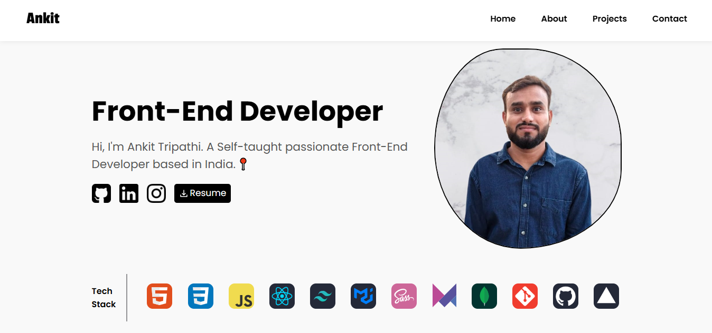
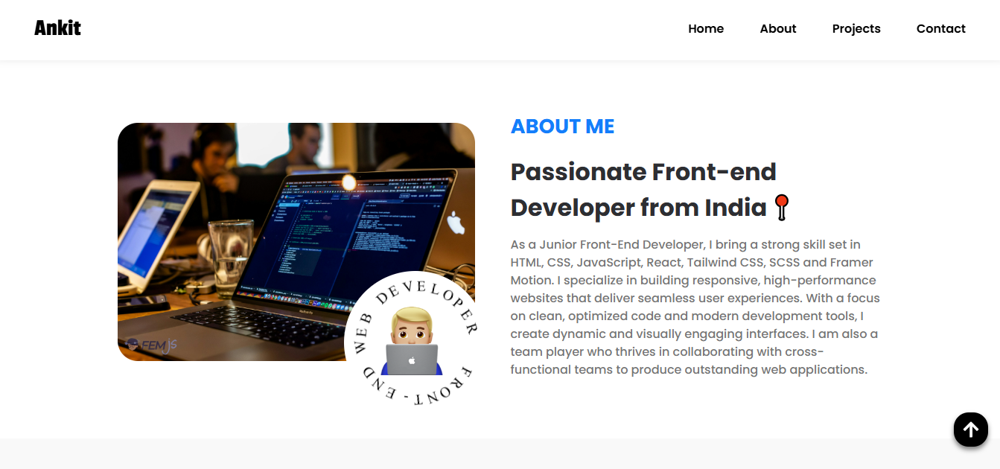
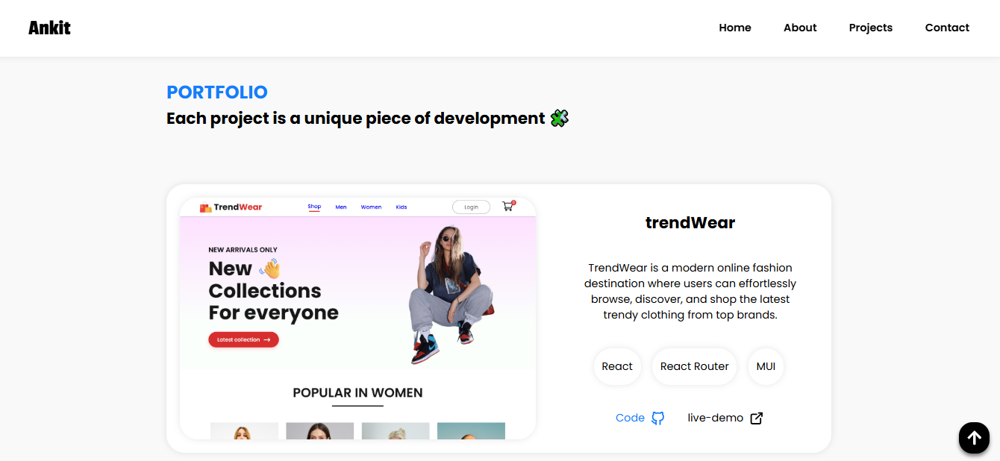
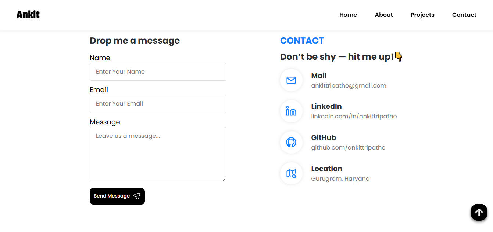

# 🚀 Ankit's - Portfolio Website
Hi, I’m Ankit Tripathi, a passionate and self-taught Front-End Developer skilled in building modern, responsive, and user-focused web applications. I specialize in technologies like React.js, JavaScript, Tailwind CSS, SCSS, Framer Motion, Material UI, HTML5, CSS3 & Git/GitHub

## 🛠 Technologies Used
- HTML
- CSS
- Javascript
- React
- React-Hook-Form
- React-toastify
- Web3Forms

## Features 🎉
- **Responsive Design** 📱 — Optimized for mobile, tablet, and desktop.
- **Smooth Animations** 🎨 — Framer Motion transitions for sections and elements.
- **Scroll-to-Top Button** ⬆️ — Quick navigation back to the top.
- **Hero Section** 🏠 — Professional title, intro, and CTA buttons.
- **About Section** 📝 — Overview of skills, experience, and goals.
- **Projects Section** 💻 — Showcases key work with descriptions and links.
- **Contact Form (Web3Forms)** 📧 — Direct email submissions without backend.
- **Toast Notifications** 🔔 — Feedback for form submissions.
- **Footer** 📜 — Copyright and quick links.
- **React Router Navigation** 🔗 — Smooth page routing without reload.

## 📸 Screenshots

| Home Page                      |
| ------------------------------ |
|  |

| About Page                       |
| -------------------------------- |
|  |

| Project Page                         |
| ------------------------------------ |
|  |

| Contact Page                         |
| ------------------------------------ |
|  |


## 📦 Getting Started

### Prerequisites

- Node.js (v14 or above)
- npm or yarn

## 🚀 How to Run the Project

```bash
# 1. Clone the repository
git clone https://github.com/ankittripathi-dev/PortFolio-Website.git
cd PortFolio-Website

# 2. Install dependencies
npm install

# 3. Start the development server
npm run dev
```

## 🔗 Links
- 🌐 **Live Demo**: [Live Demo](https://ankittripathi.vercel.app/)
- 📁 **GitHub Repo**: [Source Code](https://github.com/ankittripathi-dev/PortFolio-Website)

## 🤝 Let's Connect
If you're passionate about frontend development, UI/UX, or React-based web apps — let’s connect and collaborate!

[](https://www.linkedin.com/in/ankittripathi-devs)

[](https://github.com/ankittripathi-dev)

[](mailto:ankittripathi.dev@gmail.com)


## 🌐 Check Out My Portfolio
[](https://ankittripathi.vercel.app/)
